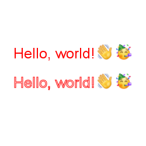

# CANVAS + EMOJICDN

This is a simple implementation of the [emojicdn](https://emojicdn.elk.sh) service for Canvas.


## Installation


```bash 
npm install canvas-emojicnd
```


## Usage

```typescript
import { createCanvas, measureText } from 'canvas'
import { fillText, strokeText } from 'canvas-emojicdn'

(async () => {
  const text = 'Hello, world!👋🥳'
  const canvas = createCanvas(200, 200)
  const ctx = canvas.getContext('2d')
  ctx.fillStyle = '#000'
  ctx.strokeStyle = '#fff'
  ctx.font = '25px Arial'
  
  // Get the width of the text
  const { width } = await measureText(ctx, text, 'whatsapp')

  // Draw the text:
  await fillText(ctx, text, canvas.width / 2 - width / 2, 100, 'whatsapp')
  await strokeText(ctx, text, canvas.width / 2 - width / 2, 200, 'whatsapp')

})()
```

<p align="center">
  
</p>

Supported emoji styles: 

* `apple`
* `google`
* `microsoft`
* `samsung`
* `whatsapp`
* `twitter`
* `messenger`
* `joypixels`
* `openmoji`
* `emojidex`
* `lg`
* `htc`
* `mozilla`


>If the emoji is not supported by the selected style, the emoji will be ignored.


## Contributing
Pull requests are welcome. For major changes, please open an issue first to discuss what you would like to change.

## License
[MIT](https://choosealicense.com/licenses/mit/)


